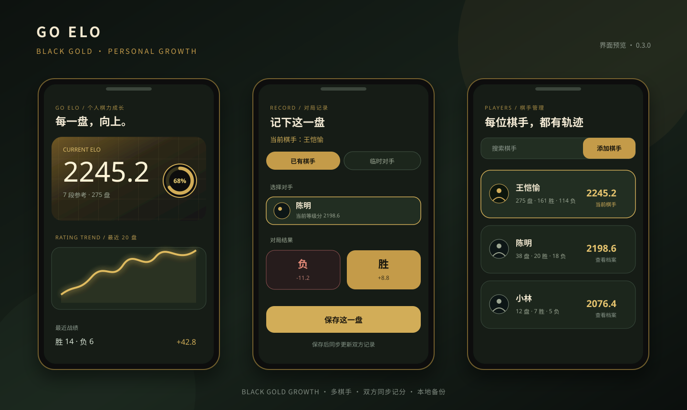

# GO ELO Android

一款面向个人棋力成长的离线围棋 ELO 记录工具。

它把每一盘对局变成可追踪的成长数据：记录结果、观察等级分变化、比较不同对手强度，并通过本地备份把完整数据带到另一台设备。应用采用黑金竞技风格，运行不需要账号和网络。

## 界面预览

上图展示成长页、已有棋手对局录入和棋手管理三个核心场景。它是根据当前 0.3.1 页面结构制作的界面预览，具体名称、分数和对局数量会随本机数据变化。

## 核心功能

- **多棋手管理**：添加多个本地棋手，分别维护姓名、初始等级分、目标和成长历史。
- **已有棋手对局**：选择已有棋手作为对手后，一次记录同时更新双方等级分和战绩。
- **临时对手估分**：输入对手段位和最近不超过 20 盘战绩，例如 11-8，实时估算对手等级分。
- **成长分析**：查看当前 ELO、参考段位、目标进度、走势、胜率、连胜和历史最高分。
- **分析增强**：输入临时对手或选择已有棋手预测胜率，并查看与棋手库对手的历史胜负、胜率和逐盘结果。
- **历史管理**：按对局类型、结果、段位和日期筛选；可筛出双方都是棋手库成员的对局。新格式对局支持更正、删除和撤销，后续分数自动重算。
- **狗榜**：本地保存野狐 ID，支持实时检索、重复校验和移除，随 `.goelo.json` 一起备份恢复。
- **本地备份与恢复**：导出包含全部棋手、对局和狗榜 ID 的 .goelo.json 文件，恢复前提供预览。
- **旧数据兼容**：支持读取旧版备份格式，保留旧历史的原始分差，不猜测缺失的对手信息。

## 计分规则

### 已有棋手

已有棋手对局使用双方赛前等级分和固定 K 值：

    E = 1 / (1 + 10 ^ ((Ropp - Rself) / 400))
    Δ = 20 × (S - E)
    Rnext = Rself + Δ

胜者增加的分数与负者减少的分数相等，计算保留完整浮点精度，界面显示一位小数。

### 临时对手

临时对手的段位基准分为 1 段 1100 分，每升一段增加 200 分（7 段为 2300，9 段为 2700）：

    B(d) = 1100 + 200 × (d - 1)

    W > 0 且 L > 0：Ropp = B(d) + 100 × log10(W / L)
    W > 0 且 L = 0：Ropp = B(d) + 600
    W = 0 且 L > 0：Ropp = B(d) - 600
    W = 0 且 L = 0：Ropp = B(d)

新录入的临时对手使用 `elo-v3` 规则（基准表修正为 1 段 1100、系数 100）；历史 `elo-v1/v2` 记录仍按各自原规则重放，避免升级后悄悄改变历史数据。全胜和全败仍分别使用基准分 ±600。

首页的**参考段位**以基准分为区间中心，每段覆盖 200 分。例如 2200 ≤ ELO < 2400 显示参考 7 段；2245 分的默认下一目标是 2400 分。这个展示区间不改变临时对手的 7 段基准分 2300。

不使用样本平滑，也不根据盘数额外加权。临时对手的估算分只用于当前这盘，不会自动创建对手档案。

## 界面

应用采用深色背景、暖金强调色和棋盘纹理，主要页面包括：

- 成长：当前 ELO、目标进度、等级分走势和最近对局。
- 分析：区间胜率、胜率预测、棋手库对手历史胜负、对手段位分布、月度趋势和连胜。
- 历史：完整对局列表、对局类型筛选、编辑和删除。
- 狗榜：录入、检索和移除野狐 ID。
- 我的：棋手档案、初始分、目标、备份与恢复。

## 安装

当前版本：**0.3.1**（versionCode 4）

直接下载仓库中的调试安装包：

[下载 GO ELO Android 0.3.1 APK](dist/go-elo-debug.apk)

如果已经安装过旧版，请直接覆盖安装，不要先卸载，以保留本机数据。应用使用相同的 applicationId 和签名，Room 数据库会自动从旧版本迁移到新版本。

## 数据与隐私

- 所有数据默认保存在设备本地。
- 不需要登录，不主动联网，不上传对局数据。
- 备份文件是可读 JSON，内容包含棋手档案、对局、狗榜 ID、计算结果和规则版本。
- 恢复操作会整体替换当前数据；应用会先保存恢复前快照。
- 旧版 .goelo.json 备份可以在新版本中读取并升级为当前格式。

## 开发

技术栈：

- Kotlin
- Jetpack Compose + Material 3
- Room
- Kotlin Serialization
- JDK 17
- Android SDK 36，最低 Android API 26

在 Windows PowerShell 中构建：

    . ./scripts/Use-Toolchain.ps1
    ./gradlew.bat :app:assembleDebug

运行完整检查：

    ./gradlew.bat :app:assembleDebug :app:lintDebug :app:testDebugUnitTest :app:compileDebugAndroidTestKotlin --offline --console=plain

当前验证结果：

- 54 项 JVM 单元测试通过。
- Android Debug 构建通过。
- Lint：0 errors。
- Android 测试源码编译通过。
- 未连接实体设备或模拟器，因此实机视觉和交互仍需在目标设备上验收。

## 项目结构

    app/src/main/java/dev/goelo/android/
    ├── backup/       备份、恢复和文件处理
    ├── data/         Room、状态存储和业务服务
    ├── model/        棋手、对局和应用状态模型
    ├── rating/       ELO 计算、重放和状态校验
    ├── stats/        胜率、走势和历史统计
    └── ui/           Compose 页面、组件和黑金主题

更多版本说明见 [docs/multi-player-0.3.0.md](docs/multi-player-0.3.0.md)。

## 许可

本项目当前主要用于个人棋力成长和本地数据管理。仓库尚未声明正式开源许可证，未经作者许可请不要将其作为独立产品重新发布。

